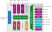

# Architecture

Cheshire is highly configurable; available features and resources depend on its parameterization. The above block diagram depicts a fully-featured Cheshire SoC, which currently provides:

* **Cores**:
    * Up to 16 Linux-capable CVA6 cores with self-invalidation-based coherence
    * A RISC-V debug module with JTAG transport

* **Peripherals**:
    * Various standard IO interfaces (UART, I2C, SPI, and GPIOs)
    * A boot ROM enabling boot from SD cards, SPI flash, or I2C EEPROM
    * A VGA display controller with built-in DMA
    * A fully-digital die-to-die serial link
    * A high-throughput system DMA

* **Interconnect**:
    * A last level cache (LLC) configurable as a scratchpad memory (SPM) per-way
    * Up to 16 external AXI manager ports and 16 AXI and Regbus subordinate ports
    * Per-manager traffic regulators for real-time applications

* **Interrupts**:
    * Core-local (CLINT *and* CLIC) and platform (PLIC) interrupt controllers
    * Dynamic interrupt routing from and to internal and external targets.

## Memory Map

Cheshire's internal memory map is *static*. While device instantiation and layout may vary, each device is provided an address space of *fixed* location and size. For this, Cheshire *reserves* the address space from `0x0` to `0x2000_0000`, which is currently allocated as follows:

+--------------------+-------------------+---------------+------+-------+
| Block              | Device            | Start         | Size | Flags |
+====================+===================+===============+======+=======+
| 256K periphs @ AXI | Debug ROM         | `0x0000_0000` | 256K | E     |
+--------------------+-------------------+---------------+------+-------+
| 4K periphs @ AXI   | AXI DMA (Cfg)     | `0x0100_0000` | 4K   |       |
+--------------------+-------------------+---------------+------+-------+
| 256K periphs @ Reg | Boot ROM          | `0x0200_0000` | 256K | E     |
|                    +-------------------+---------------+------+-------+
|                    | CLINT             | `0x0204_0000` | 256K |       |
|                    +-------------------+---------------+------+-------+
|                    | IRQ router        | `0x0208_0000` | 256K |       |
+--------------------+-------------------+---------------+------+-------+
| 4K periphs @ Reg   | SoC Regs          | `0x0300_0000` | 4K   |       |
|                    +-------------------+---------------+------+-------+
|                    | LLC (Cfg)         | `0x0300_1000` | 4K   |       |
|                    +-------------------+---------------+------+-------+
|                    | UART              | `0x0300_2000` | 4K   |       |
|                    +-------------------+---------------+------+-------+
|                    | I2C               | `0x0300_3000` | 4K   |       |
|                    +-------------------+---------------+------+-------+
|                    | SPI Host          | `0x0300_4000` | 4K   |       |
|                    +-------------------+---------------+------+-------+
|                    | GPIO              | `0x0300_5000` | 4K   |       |
|                    +-------------------+---------------+------+-------+
|                    | Serial Link (Cfg) | `0x0300_6000` | 4K   |       |
|                    +-------------------+---------------+------+-------+
|                    | VGA (Cfg)         | `0x0300_7000` | 4K   |       |
|                    +-------------------+---------------+------+-------+
|                    | AXI RT (Cfg)      | `0x0300_8000` | 4K   |       |
+--------------------+-------------------+---------------+------+-------+
| INTCs @ Reg        | PLIC              | `0x0400_0000` | 64M  |       |
|                    +-------------------+---------------+------+-------+
|                    | CLICs             | `0x0800_0000` | 64M  |       |
+--------------------+-------------------+---------------+------+-------+
| LLC SPM @ AXI      | cached            | `0x1000_0000` | 64M  | CIE   |
|                    +-------------------+---------------+------+-------+
|                    | uncached          | `0x1400_0000` | 64M  | IE    |
+--------------------+-------------------+---------------+------+-------+

The flags are defined as follows:

* **C***acheable*: Accessed data may be cached in the L1 or LLC caches
* **I***dempotent*: Multiple identical or composing accesses are equivalent to one access
* **E***xecutable*: Data in this region may be executed.

Additionally, Cheshire assumes the following parameterized layout for external resources:

+--------------------+---------------------+-------------------+-------+
| Block              | Start               | End               | Flags |
+====================+=====================+===================+=======+
| External on-chip   | `0x2000_0000`       | `0x8000_0000`     |   ?   |
+--------------------+---------------------+-------------------+-------+
| LLC out (DRAM)     | `LlcOutRegionStart` | `LlcOutRegionEnd` | CIE   |
+--------------------+---------------------+-------------------+-------+
| Serial Link        | `SlinkRegionStart`  | `SlinkRegionEnd`  |       |
+--------------------+---------------------+-------------------+-------+

The *external on-chip* region is split into a region with full `CIE` flags and one without flags to minimize parameterization complexity. The parameters `Cva6ExtCieOnTop` and `Cva6ExtCieLength` control the order and partitioning of these two regions.

The *LLC out* region must not collide with any other regions and defaults on starting at the lowest available address, `0x8000_0000`. The *Serial Link* region defaults on starting at `0x1_0000_0000` and configures the `SlinkTxAddrMask` and `SlinkTxAddrDomain` parameters to mirror the lower 32-bit space of another identical chip from this address base.

## Devices and Parameters

Except for external hart info and interface types (see [Instantiating Cheshire](../tg/integr.md#instantiating-cheshire)), Cheshire is fully parameterized through the `Cfg` struct. We will first describe global parameters, then discuss the functionality and parameterization of each device individually.

For defaults of any parameters, `cheshire_pkg::DefaultCfg` is the *single source of truth*. Note, however, that this does *not* mean `DefaultCfg` parameters are suitable for your system or usecase; please carefully consider and choose all parameters.

The following global parameters control basic functionality and features and can be read by software in the *SoC Registers*:

| Parameter     | Type / Range | Description                                        |
| ------------- | ------------ | -------------------------------------------------- |
| `RtcFreq`     | `word_bt`    | Frequency (Hz) configured for RTC                  |
| `PlatformRom` | `word_bt`    | Address of platform ROM; see [Boot ROM](#boot-rom) |
| `Bootrom`     | `bit`        | Whether boot ROM is available                      |
| `Llc`         | `bit`        | Whether LLC is available                           |
| `Uart`        | `bit`        | Whether UART is available                          |
| `I2c`         | `bit`        | Whether I2C host is available                      |
| `SpiHost`     | `bit`        | Whether SPI is available                           |
| `Gpio`        | `bit`        | Whether GPIO is available                          |
| `Dma`         | `bit`        | Whether DMA is available                           |
| `SerialLink`  | `bit`        | Whether serial link is available                   |
| `Vga`         | `bit`        | Whether VGA is available                           |
| `AxiRt`       | `bit`        | Whether AXI RT is available                        |
| `Clic`        | `bit`        | Whether CLIC is available                          |
| `IrqRouter`   | `bit`        | Whether IRQ Router is available                    |

### CVA6 Cores

| Parameter     | Type / Range | Description                                        |
| ------------- | ------------ | -------------------------------------------------- |
| `NumCores`    | `1..15`      | Number of instantiated CVA6 cores                  |

### Interconnect

### Boot ROM
